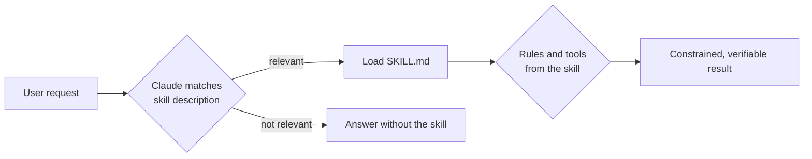

<div align="center">

# 🧠 Claude Skills

**A curated collection of [Claude Code](https://claude.com/claude-code) skills** — coding standards, testing discipline, architecture patterns, AI-agent design and DRAKON diagram tooling.

[](#-skill-catalog)
[](https://claude.com/claude-code)
[](#-drakonhub-spotlight)
[](#-skill-catalog)
[](#-skill-catalog)

[](https://github.com/InExSu/claude-skills/commits/master)
[](https://github.com/InExSu/claude-skills/commits/master)
[](https://github.com/InExSu/claude-skills)
[](#-license)

**English** · [Русский](README.ru.md)

</div>

---

## 📖 What is this?

This repository is a set of **skills** for Claude Code. A skill is a folder with a `SKILL.md` file whose YAML frontmatter contains a `name` and a `description`. Claude reads the description at startup and decides on its own whether the skill applies to the current task — so, once installed, the skills activate during normal conversation, without any special effort.

Most skills are **behavioral contracts**: they forbid a class of convenient-but-harmful shortcuts (tautological tests, patching code without a reproducing test, spaghetti functions, tokens spent on politeness). A few are **tooling**: `drakonhub` ships Python scripts, a file-format reference and ready-made templates.



---

## 📚 Skill catalog

### 🧪 Testing & correctness

| Skill | What it enforces |
|---|---|
| **[tdd-bugfix](tdd-bugfix/SKILL.md)** | Bug fixing through a strict **RED → YELLOW → GREEN** cycle: first a failing test that reproduces the bug, then a minimal patch, then a clean refactor. Never patch source code before the red test exists. |
| **[quality-tests](quality-tests/SKILL.md)** | Tests that check behavior instead of inflating coverage. A diagnostic start table plus sections on antipatterns (tautological tests), what to test, and why a suite fails to catch bugs. |
| **[self-test-design](self-test-design/SKILL.md)** | Build software like reliable hardware: Design-For-Test, built-in self-test (BIST/POST), the `TestPort` contract, state-transition tables. The golden rule: verify the **absence of unwanted** behavior, not only the presence of wanted behavior. |

### 🏗️ Architecture & refactoring

| Skill | What it enforces |
|---|---|
| **[pure-functions](pure-functions/SKILL.md)** | 7 axioms for JavaScript/TypeScript functions: input→output mapping, determinism, no side effects, `ok/error` result format, preconditions/postconditions/invariants. |
| **[if-condition-refactor](if-condition-refactor/SKILL.md)** | Complex `if`/`switch` conditions become readable predicate functions — lower cyclomatic complexity, better testability, no inlined business logic inside conditions. |
| **[noosphere](noosphere/SKILL.md)** | A single source of truth: one global state object `ns`, initialized once, mutated through a defined interface. Pure functions must **not** depend on `ns`. |
| **[state-machine-if-improves-understanding](state-machine-if-improves-understanding/SKILL.md)** | A decision rule for when a Shalyto switch state machine is justified (non-linear transitions, retry loops, pagination) and when plain SRP code is the better answer. |
| **[spaghetti-RWD](spaghetti-RWD/SKILL.md)** | Splits a monolithic function into a chain of single-responsibility steps sharing one state object, executed by a common step runner. *(opt-in: `@spaghetti`)* |

### ✍️ Naming & style *(opt-in)*

| Skill | What it enforces |
|---|---|
| **[hungarian-notation](hungarian-notation/SKILL.md)** | Type prefixes for variables, functions, object keys, class properties and constants in any language. Explicit opt-in only. *(activate with `@hungarian`)* |
| **[constant-naming-convention](constant-naming-convention/SKILL.md)** | Constants named descriptively **including the value they hold**, so the code documents itself. |
| **[token-economy](token-economy/SKILL.md)** | Every token must earn its place: no politeness padding, no redundant restatement, in prompts, instructions, docs and code. |

### 🔗 Pipelines

| Skill | What it enforces |
|---|---|
| **[rwd-chain](rwd-chain/SKILL.md)** | JavaScript pipeline pattern: each step is a decorated function over a shared mutable `NS_Container`; any step setting `s_Error` halts the chain. Built-in profiling and logging fields. |

### 🤖 AI agents & 🐉 Diagrams

| Skill | What it enforces |
|---|---|
| **[ru-psychoagent](ru-psychoagent/SKILL.md)** | Architecture principles for AI agents drawn from the Russian psychological school — Luria, Vygotsky, Bernstein, Bakhtin: internal speech, sensorimotor loops, sense-making. |
| **[drakonhub](drakonhub/SKILL.md)** | Reading, creating and editing DRAKON algorithm diagrams (`.drakon`) and structured mind maps (`.graf`): exact JSON schema, icon semantics, language rules, a validator and templates. |

## 🐉 drakonhub spotlight

The only skill with executable tooling. It turns DRAKON diagrams into something both a human and an LLM can work with reliably.

**Language rules baked into the skill:** flow goes top-down with no arrows, branching only to the right, lines never cross, and "the further right, the worse" — the happy path goes straight down while failures drift right. Exactly one `end`, one icon = one step, actions in imperative mood, questions without *and* / *or* / *not*.

### Scripts (Python 3, standard library only)

```bash
cd drakonhub

# 1. Validate a diagram against the DrakonHub import schema + DRAKON rules
python3 scripts/drakon_tool.py check templates/choice-and-loop.drakon
#   → OK: ошибок и замечаний нет

# 2. Read a diagram as indented pseudocode, split by silhouette branches
python3 scripts/drakon_tool.py read templates/minimal.drakon

# 3. Write diagrams in a compact DSL instead of hand-building JSON
python3 scripts/drakon_dsl.py to-drakon templates/workout.dsl out.drakon
python3 scripts/drakon_dsl.py to-dsl    out.drakon out.dsl
python3 scripts/drakon_dsl.py roundtrip templates/minimal.drakon
#   → OK: графы совпали (6 узлов)

# 4. Compute the silhouette layout and render it
python3 scripts/drakon_render.py svg templates/silhouette.drakon out.svg  # picture for humans
python3 scripts/drakon_render.py map templates/silhouette.drakon          # coordinate map for agents
#   → OK: templates/silhouette.drakon -> out.svg (7x6 клеток, 18 иконок)
```

### Why the DSL exists

Hand-writing `.drakon` means inventing an `id` per icon and wiring `one` / `two` links by hand — an error-prone job for an LLM. The DSL describes the algorithm as indented text, and the converter assigns ids, builds the links and lays out the silhouettes itself:

```
# Тренировка
> Условие старта: спортзал, есть 40 минут
@ Разминка
  Выполнить суставную разминку
```

| File | Purpose |
|---|---|
| `SKILL.md` | The skill itself: rules, icon semantics, format schema |
| `reference/file-format.md` | Deep dive into the `.drakon` JSON format and edge cases |
| `scripts/drakon_tool.py` | `read` (pseudocode) and `check` (validation) |
| `scripts/drakon_dsl.py` | DSL ⇄ `.drakon` conversion and round-trip verification |
| `scripts/drakon_render.py` | Silhouette layout → SVG or coordinate map |
| `templates/*.drakon`, `templates/*.dsl` | Ready-made examples: minimal, choice-and-loop, silhouette, workout |

---

## 📂 Repository layout

```
claude-skills/
├── README.md                  ← you are here (English)
├── README.ru.md               ← Russian version
├── gh.sh                      ← add-all / commit / push helper
├── constant-naming-convention/
│   └── SKILL.md
├── drakonhub/
│   ├── SKILL.md
│   ├── reference/file-format.md
│   ├── scripts/{drakon_tool,drakon_dsl,drakon_render}.py
│   ├── templates/{minimal,choice-and-loop,silhouette}.drakon
│                  workout.dsl
├── hungarian-notation/SKILL.md
├── if-condition-refactor/SKILL.md
├── noosphere/SKILL.md
├── pure-functions/SKILL.md
├── quality-tests/SKILL.md
├── ru-psychoagent/SKILL.md
├── rwd-chain/SKILL.md
├── self-test-design/SKILL.md
├── spaghetti-RWD/SKILL.md
├── state-machine-if-improves-understanding/SKILL.md
├── tdd-bugfix/SKILL.md
└── token-economy/SKILL.md
```

Every skill follows the same shape: one folder, one `SKILL.md`, YAML frontmatter with `name` + `description` (some also declare `allowed-tools`).

---

## 🚀 Getting started

### Install for every project (personal skills)

```bash
git clone https://github.com/InExSu/claude-skills.git /tmp/claude-skills
mkdir -p ~/.claude/skills
cp -R /tmp/claude-skills/*/ ~/.claude/skills/
```

### Install for one project

```bash
mkdir -p .claude/skills
cp -R /tmp/claude-skills/*/ .claude/skills/
```

Claude Code discovers skills automatically by scanning folders for `SKILL.md` and reading its frontmatter — no registration step, no config file.

To install a single skill, copy just its folder:

```bash
cp -R /tmp/claude-skills/tdd-bugfix ~/.claude/skills/
```

---

## 🛠 Usage

1. **Just ask.** Descriptions are written to trigger on real phrasing: *"fix this bug"*, *"исправь баг"*, *"why don't my tests catch anything"*, *"сделай диаграмму алгоритма"*, *"разбей функцию"*. The matching skill loads itself.
2. **Opt-in skills** never fire on their own — they require an explicit activation token: `@hungarian` for Hungarian notation, `@spaghetti` for the RWD decomposition.
3. **Combine deliberately.** `tdd-bugfix` + `quality-tests`, or `spaghetti-RWD` + `noosphere` + `rwd-chain`, form a coherent workflow: decompose, agree on state, wire the pipeline.
4. **Point at a file.** For `drakonhub`, referencing a concrete `.drakon` file plus *"check it"* or *"render it"* selects the right script.

### Commit helper

```bash
./gh.sh "add DRAKON skills"    # git add -A . && git commit -m "$1" && git push
```

---

## 🤝 Contributing

A new skill is just a folder with a `SKILL.md`:

```markdown
---
name: my-skill
description: >
  Precise trigger conditions — when to use it, and just as importantly when NOT to.
---

# My Skill

## Rules
...
```

Guidelines that keep this collection useful:

- **The description is the API.** Be explicit about triggers *and* exclusions; skills that fire everywhere are skills that fire nowhere.
- **Enforce, don't advise.** Prefer prohibitions ("never patch before a failing test exists") over gentle recommendations.
- **Show bad and good.** Before/after code pairs teach far better than abstractions.
- **State the scope.** Note the language or framework a skill applies to, so it does not leak into unrelated work.

---

## 📄 License

No license file is present in this repository yet, so all rights are reserved by the author by default. If you intend to reuse or redistribute this material, open an issue to agree on terms (for example MIT) before doing so.

<div align="center">

**[⬆ back to top](#-claude-skills)** · [Русская версия](README.ru.md)

</div>
---