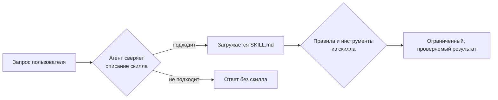

<div align="center">

# 🧠 Скиллы для AI-агентов

**Коллекция [Agent Skills](https://agentskills.io) для AI-агентов** — стандарты кода, дисциплина тестирования, архитектурные паттерны, проектирование агентов и инструменты для диаграмм DRAKON. Подходит любому агенту, реализующему открытый стандарт, в том числе [Claude Code](https://claude.com/claude-code).

[](#-каталог-скиллов)
[](https://agentskills.io)
[](#-drakonhub-под-микроскопом)
[](#-каталог-скиллов)
[](#-каталог-скиллов)

[](https://github.com/InExSu/claude-skills/commits/master)
[](https://github.com/InExSu/claude-skills/commits/master)
[](https://github.com/InExSu/claude-skills)
[](CONTRIBUTING.ru.md)
[](https://github.com/InExSu/claude-skills/actions/workflows/ci.yml)
[](LICENSE)

[English](README.md) · **Русский**

</div>

---

## 📖 Что это

Это набор **скиллов для AI-агентов, реализующих открытый стандарт [Agent Skills](https://agentskills.io)**. Скилл — папка с файлом `SKILL.md`, во frontmatter которого указаны `name` и `description`. Агент читает описания при старте и сам решает, применим ли скилл к текущей задаче, — поэтому после установки они включаются в обычном диалоге, без специальных команд.

Большинство скиллов — **контракты поведения**: они запрещают класс удобных, но вредных упрощений (тавтологичные тесты, правка кода без воспроизводящего теста, функции-спагетти, токены, потраченные на вежливость). Меньшая часть — **инструментарий**: `drakonhub` поставляет Python-скрипты, справку по формату файлов и готовые шаблоны.



---

## 📚 Каталог скиллов

### 🧪 Тестирование и корректность

| Скилл | Что он требует |
|---|---|
| **[tdd-bugfix](tdd-bugfix/SKILL.md)** | Исправление багов строго по циклу **RED → YELLOW → GREEN**: сначала падающий тест, воспроизводящий баг, затем минимальная заплатка, затем чистая правка. Патчить исходники до появления красного теста запрещено. |
| **[quality-tests](quality-tests/SKILL.md)** | Тесты, которые проверяют поведение, а не наращивают покрытие. Таблица диагностики в начале плюс разделы об антипаттернах (тавтологичные тесты), о том, что тестировать, и почему набор тестов не ловит баги. |
| **[self-test-design](self-test-design/SKILL.md)** | Программы проектируются как надёжные устройства: Design-For-Test, встроенное самотестирование (BIST/POST), контракт `TestPort`, таблицы переходов состояний. Золотое правило: проверяй **отсутствие нежелательного** поведения, а не только наличие желаемого. |

### 🏗️ Архитектура и рефакторинг

| Скилл | Что он требует |
|---|---|
| **[pure-functions](pure-functions/SKILL.md)** | 7 аксиом для функций JavaScript/TypeScript: отображение входов в выходы, детерминизм, отсутствие побочных эффектов, формат результата `ok/error`, предусловия/постусловия/инварианты. |
| **[if-condition-refactor](if-condition-refactor/SKILL.md)** | Сложные условия `if`/`switch` превращаются в читаемые предикатные функции: ниже цикломатическая сложность, лучше тестируемость, никакой бизнес-логики внутри условий. |
| **[noosphere](noosphere/SKILL.md)** | Единый источник истины: один глобальный объект состояния `ns`, инициализируемый один раз и изменяемый через определённый интерфейс. Чистые функции **не должны** зависеть от `ns`. |
| **[state-machine-if-improves-understanding](state-machine-if-improves-understanding/SKILL.md)** | Правило выбора: когда switch-машина состояний Шалыто оправдана (нелинейные переходы, retry-циклы, постраничная загрузка), а когда лучше обычный SRP-код. |
| **[spaghetti-rwd](spaghetti-rwd/SKILL.md)** | Разбивает монолитную функцию на цепочку шагов с единственной ответственностью, разделяющих один объект состояния и выполняемых общим раннером. *(opt-in: `@spaghetti`)* |

### ✍️ Имена и стиль *(opt-in)*

| Скилл | Что он требует |
|---|---|
| **[hungarian-notation](hungarian-notation/SKILL.md)** | Префиксы типов для переменных, функций, ключей объектов, свойств классов и констант в любом языке. Только явное включение. *(активация: `@hungarian`)* |
| **[constant-naming-convention](constant-naming-convention/SKILL.md)** | Константы названы описательно, **включая хранимое значение**, чтобы код документировал сам себя. |
| **[token-economy](token-economy/SKILL.md)** | Каждый токен должен работать: никакой вежливости «для галочки» и пересказа уже сказанного — в промптах, инструкциях, документации и коде. |

### 🔗 Конвейеры

| Скилл | Что он требует |
|---|---|
| **[rwd-chain](rwd-chain/SKILL.md)** | Паттерн конвейера на JavaScript: каждый шаг — декорируемая функция над общим мутабельным `NS_Container`; если шаг выставил `s_Error`, цепочка останавливается. Поля для профилирования и логирования встроены. |

### 🤖 ИИ-агенты и 🐉 Диаграммы

| Скилл | Что он требует |
|---|---|
| **[ru-psychoagent](ru-psychoagent/SKILL.md)** | Принципы архитектуры ИИ-агентов из отечественной психологической школы — Лурия, Выготский, Бернштейн, Бахтин: внутренняя речь, сенсомоторные петли, смыслообразование. |
| **[drakonhub](drakonhub/SKILL.md)** | Превращает обычный текст в файл JSON с диаграммой ДРАКОН (`.drakon`) и структурированные ментальные карты (`.graf`): точная JSON-схема, семантика иконок, правила языка, валидатор и шаблоны. Просмотр — [DrakonHub](https://drakonhub.com/) Степана Митькина. |

---

## 🐉 drakonhub под микроскопом

Единственный скилл с исполняемым инструментарием: превращает обычный текст в диаграмму ДРАКОН (`.drakon`) и структурированные ментальные карты (`.graf`). Правила, DSL, валидатор, рендер и шаблоны — в [`drakonhub/SKILL.md`](drakonhub/SKILL.md). Для просмотра — [DrakonHub](https://drakonhub.com/) Степана Митькина.

---

## 📂 Структура репозитория

```
claude-skills/
├── README.md                  ← английская версия
├── README.ru.md               ← вы здесь (русская версия)
├── CONTRIBUTING.md            ← как предложить скилл или правку
├── CONTRIBUTING.ru.md
├── CODE_OF_CONDUCT.md         ← Contributor Covenant 2.1
├── SECURITY.md                ← модель угроз и как сообщить
├── LICENSE                    ← MIT
├── .editorconfig
├── .github/
│   ├── workflows/ci.yml       ← проверки на каждый push и pull request
│   ├── ISSUE_TEMPLATE/        ← формы бага и предложения скилла, плюс config.yml
│   ├── scripts/check_skills.py
│   └── PULL_REQUEST_TEMPLATE.md
├── AGENTS.md                  ← машиночитаемые заметки для AI-агентов, потребляющих репозиторий
├── constant-naming-convention/
│   └── SKILL.md
├── drakonhub/
│   ├── SKILL.md
│   ├── reference/{file-format,engine-rules,code-generator}.md
│   ├── scripts/{drakon_format,drakon_tool,drakon_dsl,drakon_render,drakon_try}.py
│   └── templates/{minimal,choice-and-loop,silhouette,select}.drakon
│                  {workout.dsl,mind-map.graf}
├── hungarian-notation/SKILL.md
├── if-condition-refactor/SKILL.md
├── noosphere/SKILL.md
├── pure-functions/SKILL.md
├── quality-tests/SKILL.md
├── ru-psychoagent/SKILL.md
├── rwd-chain/SKILL.md
├── self-test-design/SKILL.md
├── spaghetti-rwd/SKILL.md
├── state-machine-if-improves-understanding/SKILL.md
├── tdd-bugfix/SKILL.md
└── token-economy/SKILL.md
```

Все скиллы устроены одинаково: одна папка, один `SKILL.md`, YAML-frontmatter с `name` + `description` (у части указан ещё `allowed-tools`).

---

## 🚀 Установка

Склонируйте один раз, затем укажите своему агенту на папки:

```bash
git clone https://github.com/InExSu/claude-skills.git /tmp/claude-skills
```

Скиллы — это обычные папки, их потребит всё, что реализует стандарт [Agent Skills](https://agentskills.io). Куда именно положить папки, зависит от агента — смотрите его документацию про каталог скиллов. Два примера с Claude Code:

```bash
# все проекты: личные скиллы
mkdir -p ~/.claude/skills
cp -R /tmp/claude-skills/*/ ~/.claude/skills/

# один проект
mkdir -p .claude/skills
cp -R /tmp/claude-skills/*/ .claude/skills/
```

Ни регистрации, ни файла конфигурации: если папка с `SKILL.md` есть там, где агент ищет скиллы, — скилл установлен.

Чтобы поставить один скилл, скопируйте только его папку — она самодостаточна (справка и скрипты, если есть, лежат внутри той же папки):

```bash
cp -R /tmp/claude-skills/tdd-bugfix ~/.claude/skills/
```

### Использование скилла с другим агентом

- Скилл — это сама папка: отдайте агенту `SKILL.md` (или папку с ним) — как файл для чтения, либо скопируйте папку в каталог скиллов вашего агента, как в примерах выше. Раскладка всегда одинакова: `SKILL.md` плюс, для `drakonhub`, подпапки `reference/`, `scripts/` и `templates/`.
- Два момента, которые агенты обрабатывают по-разному, — стоит знать заранее: предодобренные инструменты (`allowed-tools` в двух здешних скиллах помечен в стандарте как экспериментальный и поддерживается неравномерно) и то, как агент сопоставляет `description`, — точные фразы-триггеры живут во frontmatter каждого скилла (см. таблицу скиллов или выполните `skills-ref to-prompt <папка-скилла>`).

---

## 🛠 Использование

1. **Просто спрашивайте.** Описания написаны под живые формулировки: *«исправь баг»*, *«fix this bug»*, *«почему тесты ничего не ловят»*, *«сделай диаграмму алгоритма»*, *«разбей функцию»*. Подходящий скилл загрузится сам.
2. **Opt-in скиллы** сами не срабатывают — нужен явный токен активации: `@hungarian` для венгерской нотации, `@spaghetti` для RWD-декомпозиции.
3. **Комбинируйте осознанно.** `tdd-bugfix` + `quality-tests` или `spaghetti-rwd` + `noosphere` + `rwd-chain` образуют связный процесс: разложить, договориться о состоянии, собрать конвейер.
4. **Указывайте на файл.** Для `drakonhub` упоминание конкретного `.drakon` плюс *«проверь»* или *«отрисуй»* выбирает нужный скрипт.

### Автоматические проверки

CI запускается на каждый push и pull request ([`.github/workflows/ci.yml`](.github/workflows/ci.yml)). Те же команды работают локально:

```bash
python3 .github/scripts/check_skills.py       # frontmatter, каталог README, относительные ссылки
cd drakonhub
for f in templates/*.drakon; do python3 scripts/drakon_tool.py check "$f"; done
python3 scripts/drakon_dsl.py roundtrip templates/minimal.drakon
python3 scripts/drakon_render.py svg templates/silhouette.drakon /tmp/out.svg
```

---

## 🤝 Как добавить свой скилл

Pull request'ы приветствуются — от исправления опечатки до целого нового скилла. Полный процесс описан в **[CONTRIBUTING.ru.md](CONTRIBUTING.ru.md)**: каким должно быть хорошее `description`, правила к содержанию, проверки перед отправкой и что мержится быстрее всего. Шаблон pull request'а спрашивает, какую проблему решает правка и когда скилл **не** должен срабатывать.

Новый скилл — это просто папка с `SKILL.md`:

```markdown
---
name: my-skill
description: >
  Точные условия срабатывания — когда применять и, что не менее важно, когда НЕТ.
---

# My Skill

## Правила
...
```

Правила, которые держат коллекцию полезной:

- **Описание — это API.** Явно указывайте и триггеры, и исключения: скилл, который срабатывает везде, не срабатывает нигде.
- **Требуйте, а не советуйте.** Запрет («никогда не патчить код, пока нет падающего теста») работает лучше мягкой рекомендации.
- **Показывайте плохое и хорошее.** Пары «до/после» учат лучше абстракций.
- **Указывайте область применения.** Отмечайте язык или фреймворк, чтобы скилл не протекал в чужую работу.

---

## 📄 Лицензия

[MIT](LICENSE) © 2026 Михаил Попов (InExSu)

Простыми словами: используйте, форкайте, встраивайте в свой продукт, изменяйте, продавайте. Единственная обязанность — сохранять уведомление об авторских правах и текст лицензии вместе с копией. Гарантий нет.

```
Permission is hereby granted, free of charge, to any person obtaining a copy
of this software and associated documentation files (the "Software"), to deal
in the Software without restriction...
```

Вклад принимается под той же лицензией — см. [CONTRIBUTING.ru.md](CONTRIBUTING.ru.md).

<div align="center">

**[⬆ наверх](#-скиллы-для-ai-агентов)** · [English version](README.md)

</div>
